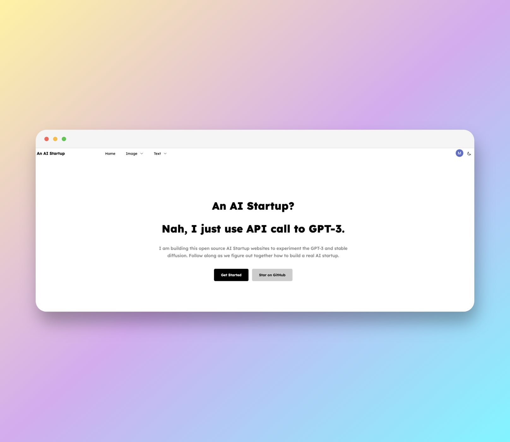

# An AI Startup - Free AI Startup Sass Web APP Template

Free, open-source, fullstack AI startup website comes with everything you need to launch a AI startup, business, or SaaS website, including GPT, Stable Diffusion technologies.



### ✨ Key Features

- Crafted for Startup and SaaS Business
- Next.js 13 and Tailwind CSS
- All Essential Business Sections and Pages
- AI applications for creating AI image, Chat and more!
- Prisma, Supabase Database for User Login
- High-quality and "Notion" Like Design
- Dark and Light Toggle with Next Theme
- Google Auth with NextAuth
  and Much More Features Coming Up ...

### [🚀 View Demo](https://an-ai-startup.vercel.app//)

### [🔌 Gituh](https://github.com/BruceWangyq/ai-project)

### [🐦Twitter](https://twitter.com/brucewangdev)

## Running Locally

1. Install dependencies using yarn:

```sh
yarn install
```

2. Copy `.env.example` to `.env.local` and update the variables.

```sh
cp .env.example .env.local
```

3. Start the development server:

```sh
yarn run dev
```

### 📄 License

"An AI Startup" is 100% free and open-source, feel free to use with your personal and commercial projects.

### 💜 Support

If you like the website, please star this repository to inspire the team to create more stuff like this and reach more users like you!
